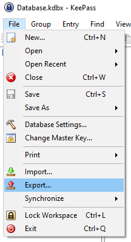
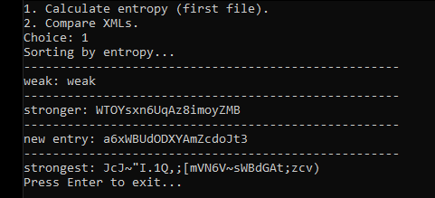
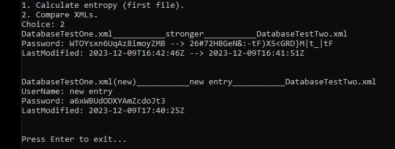

<br/>
<p align="center">
  <a href="https://github.com/fpasqu/kp2comparator">
    
  </a>

  <h3 align="center">kp2comparator</h3>

  <p align="center">
    Comparator and entropy sorter for KeePass 2 XML exports.
    <br/>
    <br/>
    <a href="https://github.com/fpasqu/kp2comparator/issues">Report Bug</a>
    .
    <a href="https://github.com/fpasqu/kp2comparator/issues">Request Feature</a>
  </p>
</p>

  
 

## About The Project

If you use an offline password manager like KeePass 2 and you often change your passwords on different devices, this script will help you keep track of new entries, list passwords by entropy and notify you if there are differences between the two databases.

### Prerequisites

All you'll need to run this script is install Python. You can find the download page [here](https://www.python.org/downloads/).

To prepare the databases to compare, export them from KeePass 2 by navigating to this menu:



Select the option 'Keep Pass XML (2.x)' and save in the respective project folder. Repeat the process for the other database.

### Usage

To run the script, just double click it or run it by command line:

```sh
python kp2comparator.py
```

When running the script, you will be presented with 2 choices. The first choice will allow you to sort all passwords by entropy of the first folder, allowing you to see which passwords are more vulnerable:



The second choice will let you see changes, indicating which entry has been updated and if there are new ones:



## License

Distributed under the MIT License. See [LICENSE](https://github.com/fpasqu/kp2comparator/blob/main/LICENSE) for more information.

## Authors

* **Federico Pasquali** - *IT Consultant* - [fpasqu](https://github.com/fpasqu/)
